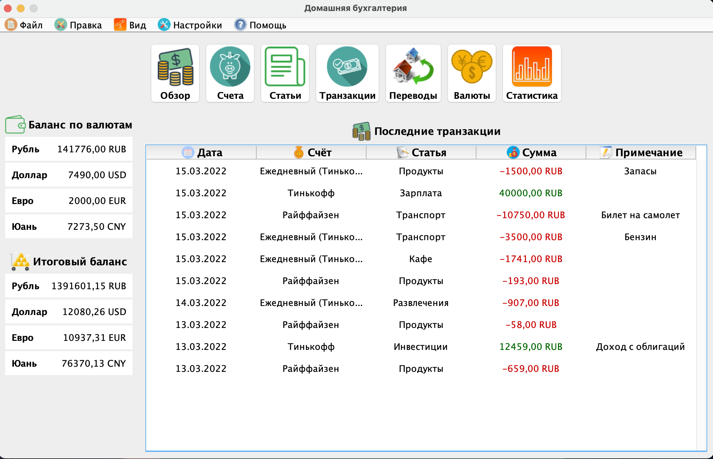

# 🚀 PersonalFinance
Программа для учёта личных финансов 💰

#### 🎯 Цель проекта:
Применить, а также закрепить знания полученные из книг и небольших проектов разной сложности

## 🔥 Обзор программы:

#### Ключевые слова:
- Maven
- ООП
- Структуры данных
- GUI
- XML
- Таблицы

#### Программа имеет следующие модули:
- Статьи с расходами и доходами
- Добавление разных валют (+ обновление курса)
- Добавление счетов и переводы между ними
- Вывод транзакций за период
- Вывод общего баланса по каждой валюте и итогового баланса в одной валюте
- Вывод гистограмм с выбранной информаций
- Сохранение и загрузка данных
- Выбор языка (RU, EN)

#### Скриншоты:

  
   
  

## 🗒 Декомпозиция:

Общее представление интерфейса перед разработкой

<pre>

┌──┤ ОБЩИЙ ВИД ПРОГРАММЫ ├─────────▰▰▰
│
├─▣ Меню
├─▣ Панель инструментов
├─▣ Содержимое окна
│
└───────────────────────────────▰▰▰

┌──┤ ГЛАВНОЕ ОКНО ├─────────▰▰▰
│
├─◈ Меню программы
├─◈ Панель инструментов
├───────────────────────────────────
│
├─◈ Баланс            │  Последние доходы и расходы
├─◈ Баланс в валютах  │  
│
└───────────────────────────────▰▰▰

┌──┤ СЧЕТА ├─────────▰▰▰
│
├─◈ Меню программы
├─◈ Панель инструментов
├───────────────────────────────────
│
├─◈ Баланс            │  Кнопки добавления, редактирования и удаления счетов
├─◈ Баланс в валютах  │  Счета
│
└───────────────────────────────▰▰▰

┌──┤ СТАТЬИ ├─────────▰▰▰
│
├─◈ Меню программы
├─◈ Панель инструментов
├───────────────────────────────────
│
├─◈ Баланс            │  Кнопки добавления, редактирования и удаления статей
├─◈ Баланс в валютах  │  Статьи
│
└───────────────────────────────▰▰▰

┌──┤ ТРАНЗАКЦИИ ├─────────▰▰▰
│
├─◈ Меню программы
├─◈ Панель инструментов
├───────────────────────────────────
│
├─◈ Баланс            │  Кнопки добавления, редактирования и удаления транзакций
├─◈ Баланс в валютах  │  Выбор периода, транзакции
│
└───────────────────────────────▰▰▰

┌──┤ ПЕРЕВОДЫ ├─────────▰▰▰
│
├─◈ Меню программы
├─◈ Панель инструментов
├───────────────────────────────────
│
├─◈ Баланс            │  Кнопки добавления, редактирования и удаления переводов
├─◈ Баланс в валютах  │  Выбор периода, переводы
│
└───────────────────────────────▰▰▰

┌──┤ ВАЛЮТЫ ├─────────▰▰▰
│
├─◈ Меню программы
├─◈ Панель инструментов
├───────────────────────────────────
│
├─◈ Баланс            │  Кнопки добавления, редактирования и удаления валют
├─◈ Баланс в валютах  │  Выбор периода, валюты
│
└───────────────────────────────▰▰▰

┌──┤ СТАТИСТИКА ├─────────▰▰▰
│
├─◈ Меню программы
├─◈ Панель инструментов
├───────────────────────────────────
│
├─◈ Баланс            │  Выбор периода
├─◈ Баланс в валютах  │  Гистограмма доходов/расходов
│
└───────────────────────────────▰▰▰

</pre>

