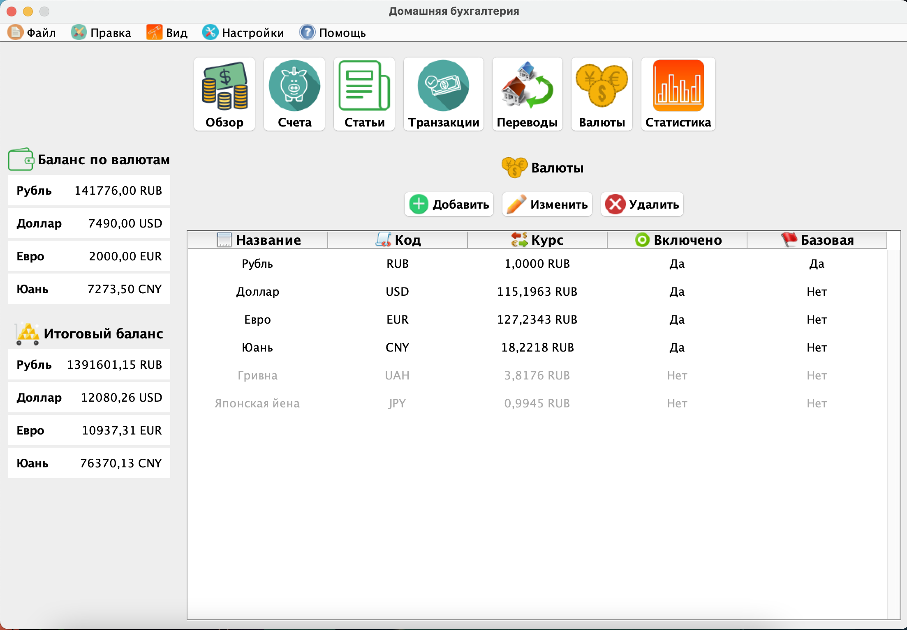
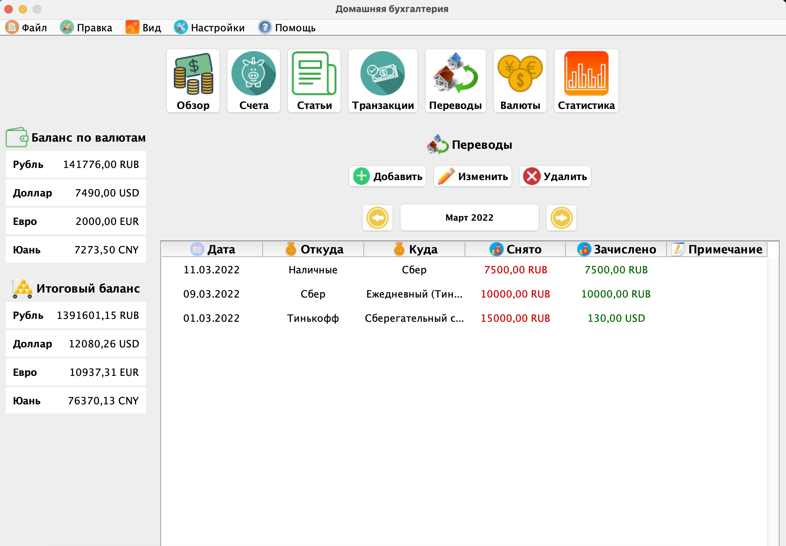

# PersonalFinance
💰 Программа для учёта личных финансов

  
   
  

## Цель проекта:
Применить, а также закрепить знания полученные из книг и небольших проектов разной сложности

Программа должна иметь следующие модули:
- Статьи с расходами и доходами
- Добавление разных валют (+ обновление курса)
- Добавление счетов и переводы между ними
- Вывод транзакций за период
- Вывод общего баланса по каждой валюте и итогового баланса в каждой валюте (если перевести в неё все деньги)
- Вывод гистограмм с выбранной информаций
- Сохранение и загрузка данных
- Выбор языка (RU, EN)

## Что было использовано:
- XML
- GUI
- ООП
- Структуры данных
- Таблицы

